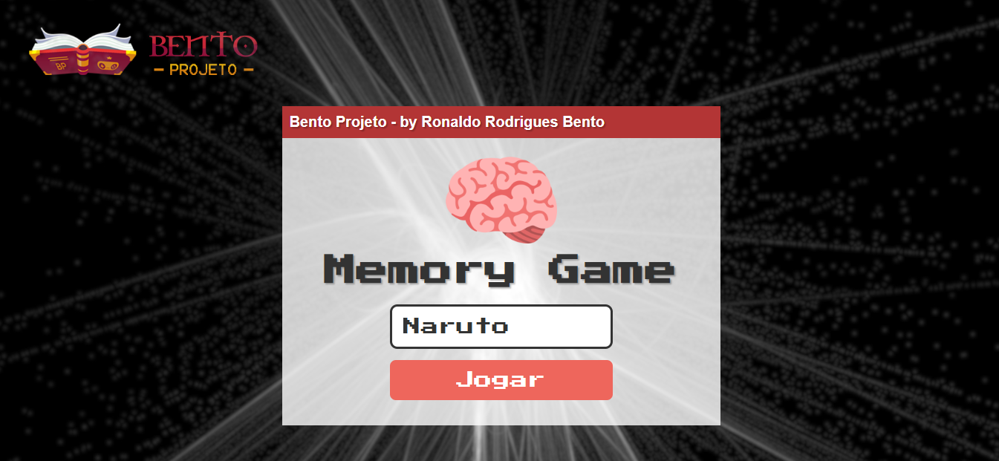
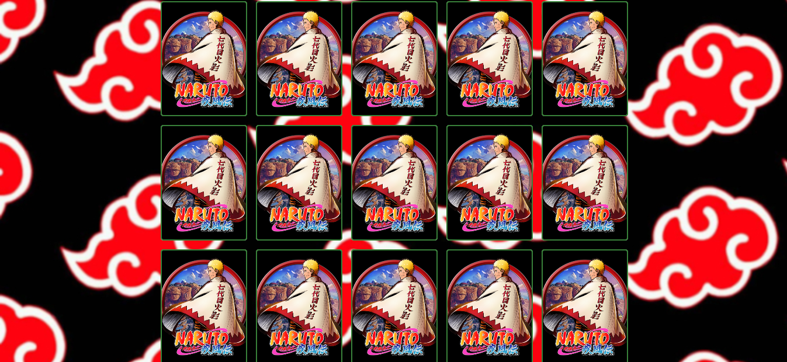
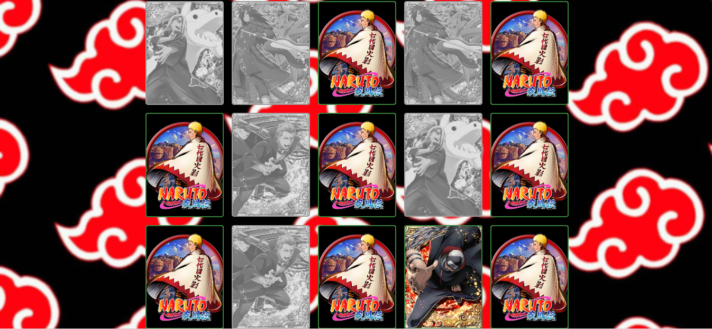

# memory-game-naruto

## Jogo de Memória - Naruto Shippuden Membros da Akatsuki

   

## O que é Akatsuke?

_**Akatsuki**_ era uma organização fictícia do mangá e anime Naruto que buscava a paz, mas que com o tempo acabou se tornando uma organização de mercenários. Foi apresentada durante a primeira parte da série (Naruto), mas os seus membros foram sendo divulgados e ganhando importância como os principais antagonistas da série durante a segunda parte (Naruto: Shippūden). Essa organização foi composta originalmente por dez ninjas exilados de suas vilas, os nukenins.

## Screenshot do Jogo de Memória:

  

  

  

<h2>:bookmark_tabs: Descrição</h2>
 
## Desenvolvimento do game:

O desenvolvimento do jogo de memória dos personagnes da Organização Akatsuke foi dividido em etapas, são elas:

1. Desenvolvimento do Menu Login na pagina index;
2. Game Resources Images;
3. Estilização em CSS;
4. Desenvolvimento da pasta page - game.html e scripts do processo do game;
5. Mensagem de parabêns e informações de quanto tempo o jogador levou para vencer.

***

 
<strong>JavaScript</strong> é uma linguagem de programação de alto nível criada, a princípio, para ser executada em navegadores e manipular comportamentos de páginas web.
 Segundo a <em>Mozilla Foundation</em>, atual nome da antiga Netscape Communications Corporations, empresa responsável pela criação do JS, "JavaScript é uma linguagem de programação, leve, interpretada, orientada a objetos, baseada em protótipos e em first-class functions (funções de primeira classe), mais conhecida como a linguagem de script da Internet."

Com seus scripts é possível incluir, em uma página estática, elementos dinâmicos como mapas, formulários, operações numéricas, animações, infográficos interativos e muito mais.

O <strong>GitHub Pages</strong> é um serviço de hospedagem de site estático que usa arquivos HTML, CSS e JavaScript diretamente de um repositório no GitHub e, como opção, executa os arquivos por meio de um processo e publica um site.

<a href="https://ronaldobento.github.io/memory-game-naruto/" target="_blank" rel="external" title="Clique aqui para entrar no site do game memory-game-naruto"><>Clique aqui para entrar no site do projeto pokemon-main ou utilize o QR Code abaixo</strong></a>

  

## IMPORTANTE 
 
   
  
 
Você tem todo o direito de usar esse material para seu próprio aprendizado. Espero que seja útil o conteúdo disponibilizado.
 

